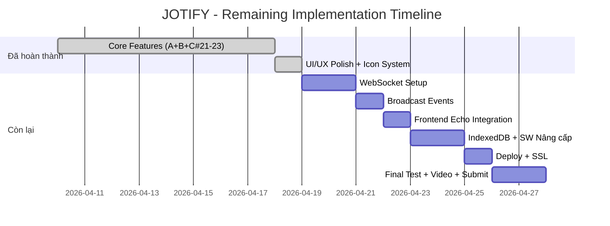

# 📋 SRS & Implementation Plan — JOTIFY (NoteKeeper)
## Đồ án Cuối kỳ Lập trình Web (503073) — HK2/2024-2025

---

## I. TỔNG QUAN DỰ ÁN

### 1.1 Mục tiêu
Xây dựng ứng dụng **quản lý ghi chú trực tuyến (JOTIFY)** cho phép người dùng tạo, tổ chức, chia sẻ ghi chú với đầy đủ tính năng bảo mật, cộng tác thời gian thực và khả năng hoạt động offline.

### 1.2 Công nghệ sử dụng

| Thành phần | Công nghệ | Source code reference |
|---|---|---|
| **Backend** | Laravel 13 (PHP 8.3) | `composer.json` L9-10: `"php": "^8.3"`, `"laravel/framework": "^13.0"` |
| **Frontend** | Blade Templates + Alpine.js 3.15 + Vanilla JS | `package.json` L22: `"alpinejs": "^3.15.11"`, `resources/views/**/*.blade.php` |
| **CSS Framework** | Tailwind CSS 4.0 + Vanilla CSS Design System | `package.json` L16: `"tailwindcss": "^4.0.0"`, `resources/css/app.css` L10: `@import 'tailwindcss'` |
| **Database** | MySQL 8 (XAMPP local) | `.env` L19: `DB_CONNECTION=mysql`, `config/database.php` L47-65 |
| **Mail** | PHPMailer 7.0 qua SMTP Gmail | `composer.json` L12: `"phpmailer/phpmailer": "^7.0"`, `app/Services/MailService.php` |
| **PWA / Offline** | Service Worker v15 + IndexedDB (idb 8.0) + Cache API | `public/sw.js` L8: `CACHE_VER='jotify-v15'`, `resources/js/offline-db.js` L5: `import { openDB } from 'idb'` |
| **Offline Auth** | bcryptjs 3.0 (client-side hash verify) | `package.json` L23: `"bcryptjs": "^3.0.3"`, `resources/js/app.js` L16,72 |
| **Build Tool** | Vite 8.0 + laravel-vite-plugin 3.0 | `package.json` L14,17: `"vite": "^8.0.0"`, `vite.config.js` |
| **UI Icons** | Google Material Icons Outlined (npm bundle) | `package.json` L25: `"material-icons": "^1.13.14"` |
| **Font** | Inter (self-hosted via @fontsource, không dùng Google CDN) | `package.json` L21: `"@fontsource/inter": "^5.2.8"`, `resources/css/app.css` L2-7 |
| **Realtime** | Pusher WebSocket + Laravel Echo | `composer.json` L13: `"pusher/pusher-php-server": "7.2"`, `package.json` L13,15: `"laravel-echo"`, `"pusher-js"` |
| **HTTP Client** | Axios | `package.json` L11: `"axios": ">=1.11.0"`, `resources/js/bootstrap.js` |
| **State Persist** | @alpinejs/persist | `package.json` L20: `"@alpinejs/persist": "^3.15.11"`, `resources/js/app.js` L3,20 |

### 1.3 Cấu trúc dự án

```
CKWeb2/
├── app/
│   ├── Http/Controllers/
│   │   ├── Auth/
│   │   │   ├── RegisterController.php        ✅
│   │   │   ├── LoginController.php           ✅
│   │   │   ├── ActivationController.php      ✅
│   │   │   └── ForgotPasswordController.php  ✅
│   │   ├── NoteController.php                ✅
│   │   ├── LabelController.php               ✅
│   │   ├── ShareController.php               ✅
│   │   ├── ProfileController.php             ✅
│   │   └── PreferenceController.php          ✅
│   ├── Models/
│   │   ├── User.php                          ✅
│   │   ├── Note.php                          ✅
│   │   ├── Label.php                         ✅
│   │   ├── NoteImage.php                     ✅
│   │   ├── NoteShare.php                     ✅
│   │   ├── Notification.php                  ✅
│   │   └── UserPreference.php                ✅
│   └── Services/
│       └── MailService.php                   ✅ (PHPMailer)
├── database/migrations/                      ✅ (10 migration files)
├── resources/
│   ├── css/app.css                           ✅ (Design System đầy đủ)
│   ├── js/app.js                             ✅ (Alpine + Echo + Pusher + bcryptjs + IDB)
│   ├── js/offline-db.js                      ✅ (IndexedDB wrapper — idb library)
│   └── views/
│       ├── auth/ (login, register, forgot, otp, reset)     ✅
│       ├── notes/ (index, editor, shared, shared-editor)   ✅
│       ├── labels/ (manage, modal)                         ✅
│       ├── profile/ (show, edit, change-password)          ✅
│       ├── preferences/ (edit)                             ✅
│       ├── emails/ (activation, password-reset, note-shared) ✅
│       └── layouts/ (app)                                  ✅
├── public/
│   ├── sw.js                                 ✅ (Service Worker v15 — Cache-First assets, Network-First pages)
│   ├── manifest.json                         ✅ (PWA manifest)
│   ├── offline.html                          ✅
│   └── offline-note.html                     ✅ (Offline note editor fallback)
├── routes/web.php                            ✅ (121 dòng, 50+ routes)
└── routes/channels.php                       ✅ (Broadcast channel auth — `note.{noteId}`)
```

---

## II. SOFTWARE REQUIREMENTS SPECIFICATION (SRS)

### 2.1 Yêu cầu chức năng — Theo 28 Tiêu chí Rubric

#### 📦 NHÓM A: Quản lý Tài khoản (Account Management) — 2.0 điểm

| # | Tiêu chí | Điểm | Mô tả yêu cầu | Trạng thái hiện tại | Kết quả |
|---|---|---|---|---|---|
| 1 | **User Registration** | 0.25 | Đăng ký với email, display name, password (nhập 2 lần). Hash bcrypt. Tự động đăng nhập sau đăng ký. Gửi email activation. | Form 4 trường: email, display_name, password, password_confirmation. `RegisterController` dùng `Hash::make()`, auto-login bằng `Auth::login()`, gửi PHPMailer activation email. | ✅ **PASS** |
| 2 | **Account Activation** | 0.25 | Gửi email chứa link activation. Khi chưa kích hoạt: hiện thông báo nổi bật. Click link → kích hoạt → ẩn thông báo. | Banner amber xuất hiện ở top layout khi `!is_activated`. Có nút "Resend Email". `ActivationController` xử lý link activation. | ✅ **PASS** |
| 3 | **User Login/Logout** | 0.25 | Đăng nhập bằng email/password. Chưa đăng nhập → redirect login. Logout invalidate session. | `LoginController` + middleware `auth`/`guest`. Logout dùng `Auth::logout()` + session invalidate. Split-screen login/register. | ✅ **PASS** |
| 4 | **Password Reset** | 0.25 | Reset qua email: link reset HOẶC OTP. Sau reset → đăng nhập lại. | `ForgotPasswordController` hỗ trợ cả email link + OTP 6 số. Sau reset redirect về login. | ✅ **PASS** |
| 5 | **View Profile & Avatar** | 0.25 | Xem thông tin profile và avatar. | `profile/show.blade.php`: avatar, display_name, email, trạng thái verified, member since, số notes. | ✅ **PASS** |
| 6 | **Edit Profile & Avatar** | 0.25 | Chỉnh sửa display name, email, upload avatar. | `profile/edit.blade.php`: click-to-upload avatar với preview, edit badge, form sửa display_name + email, nút Remove Avatar. | ✅ **PASS** |
| 7 | **Change Password** | 0.25 | Đổi mật khẩu: nhập mật khẩu cũ + mới (confirmed). | `change-password.blade.php`: 3 fields. `ProfileController::changePassword()` validate đầy đủ. | ✅ **PASS** |
| 8 | **User Preferences** | 0.25 | Cài đặt font size, note color, theme (light/dark). | `preferences/edit.blade.php`: radio theme (light/dark), 4 font sizes (S/M/L/XL), 10 color swatches. Dark mode toggle realtime ở header với smooth CSS transition. | ✅ **PASS** |

> [!TIP]
> **🧪 NHÓM A: 8/8 PASS ✅ → 2.0/2.0 điểm**

---

#### 📝 NHÓM B: Quản lý Ghi chú Cơ bản (Simple Note Management) — 4.0 điểm

| # | Tiêu chí | Điểm | Mô tả yêu cầu | Trạng thái hiện tại | Kết quả |
|---|---|---|---|---|---|
| 9 | **Display notes in list view** | 0.25 | Hiển thị ghi chú dạng danh sách. | Toggle button `switchView('list')` ở header, lưu preference vào DB qua AJAX `/preferences/view-mode`. List view render với status icons (pin/lock/share). | ✅ **PASS** |
| 10 | **Display notes in grid view** | 0.25 | Hiển thị ghi chú dạng lưới (mặc định). | Default `view_mode = 'grid'`. Grid render `grid-cols-1 sm:grid-cols-2 lg:grid-cols-3`. Status icons + labels trên cả 2 view. | ✅ **PASS** |
| 11 | **Create notes** | 0.25 | Tạo ghi chú mới, chỉ có title + content. | POST `/notes` → `create()` tạo note trống với note_color từ preferences → redirect `/notes/{id}/edit`. Nút "New Note" ở header. | ✅ **PASS** |
| 12 | **Update notes** | 0.25 | Chỉnh sửa ghi chú, cùng giao diện với tạo mới. | `editor.blade.php` dùng chung cho create và edit. Alpine.js `noteEditor()` bind title và content. Auto-save debounce 1000ms/1500ms. | ✅ **PASS** |
| 13 | **Delete notes** | 0.25 | Xoá ghi chú, có dialog xác nhận. | Modal `#delete-modal` với message "This action cannot be undone". Nếu note có password → yêu cầu nhập trước. AJAX `DELETE /notes/{id}`. Delete cả trong editor. | ✅ **PASS** |
| 14 | **Auto-save notes** | 0.25 | Tự động lưu, không cần nút Save. | Debounce 1000ms cho title, 1500ms cho content. Status: "Saving..." (spinner) → "Saved MM/DD" (cloud_done xanh) → "Save failed" (đỏ). | ✅ **PASS** |
| 15 | **Attach images to notes** | 0.25 | Đính kèm 1 hoặc nhiều ảnh. | Section "Attachments" trong editor. `input[type=file][multiple]`. Upload AJAX `/notes/{id}/upload-image`. Grid preview. Xoá từng ảnh. | ✅ **PASS** |
| 16 | **Pin notes to top** | 0.25 | Ghim ghi chú lên đầu, sắp xếp theo thời gian ghim. | Nút pin trên card (hover actions) và trong editor. `togglePin()` AJAX. Pinned notes có icon 📌 amber. Sort pinned_at. Re-sort DOM ngay (không cần reload). | ✅ **PASS** |
| 17 | **Search notes** | 0.25 | Tìm kiếm live (realtime khi gõ), tìm trong title + content. | Search input ở header. Debounce 300ms. Spinner chỉ hiện khi fetch thực sự bắt đầu (không flicker). AJAX `/notes?search=...` → JSON render. No-results state. | ✅ **PASS** |
| 18 | **Label management** | 0.25 | CRUD labels (listing, add, edit, delete). | `labels/manage.blade.php` + `LabelController` full CRUD. Color picker, name. Modal quản lý từ sidebar (gear icon). | ✅ **PASS** |
| 19 | **Attach labels to notes** | 0.25 | Gắn label vào note (many-to-many). | Dropdown "Add Label" trong editor. Search label theo tên. `toggleLabel()` → PUT `/notes/{id}/labels`. Sync pivot `label_note`. Checkmark trên label đã gắn. | ✅ **PASS** |
| 20 | **Filter notes by labels** | 0.25 | Lọc ghi chú theo labels. | Label chips đầu notes page. Click chip → AJAX `?labels={id}`. Active highlighting. "All Notes" chip reset. Kết hợp được với live search. | ✅ **PASS** |

> [!TIP]
> **🧪 NHÓM B: 12/12 PASS ✅ → 4.0/4.0 điểm**

---

#### 🔐 NHÓM C: Quản lý Ghi chú Nâng cao (Advanced Note Management) — 2.0 điểm

| # | Tiêu chí | Điểm | Mô tả yêu cầu | Trạng thái hiện tại | Kết quả |
|---|---|---|---|---|---|
| 21 | **Enable/disable password on notes** | 0.5 | Bật/tắt khoá note bằng mật khẩu riêng. Đặt: nhập 2 lần. Tắt: nhập lại để xác nhận. | Form set-password (confirmed). `setPassword()` dùng `Hash::make()`. Form remove-password yêu cầu password hiện tại. Dropdown trong editor header. | ✅ **PASS** |
| 22 | **Password protection, change password** | 0.5 | Note khoá: phải nhập password mới xem/sửa/xoá. Đổi password: nhập cũ + mới 2 lần. | Modal `#password-modal` lúc edit/delete. `unlockNote()` verify bcrypt. Session `note_unlocked_{id}`. `changeNotePassword()` yêu cầu current + new. | ✅ **PASS** |
| 23 | **Share and receive notes** | 0.5 | Chia sẻ note qua email (read/edit). Validate email. Thông báo người nhận. Owner quản lý danh sách. | Share modal: email input + permission dropdown (View/Edit). Validate email, check user tồn tại, tạo Notification, gửi email. Owner thấy list, đổi permission, revoke. | ✅ **PASS** |
| 24 | **Collaboration & realtime modification** | 0.5 | Shared notes quyền edit → cộng tác realtime bằng **WebSocket**. Nhiều người chỉnh sửa đồng thời. | **Pusher WebSocket** qua Laravel Echo. `NoteContentUpdated` broadcast event (`app/Events/NoteContentUpdated.php` L12). Private channel `note.{id}` authorize qua `routes/channels.php` L14. `shared-editor.blade.php` L353,413 subscribe `Echo.private()`. `NoteController::autoSave()` L124 + `ShareController::autoSaveShared()` L281 đều `broadcast()`. Backend: `pusher/pusher-php-server` 7.2 (`composer.json` L13). Frontend: `laravel-echo` 2.3 + `pusher-js` 8.5 (`package.json` L13-15), init tại `resources/js/app.js` L27-45. | ✅ **PASS** |

> [!TIP]
> **🧪 NHÓM C: 4/4 PASS ✅ → 2.0/2.0 điểm**

---

#### 🌐 NHÓM D: Yêu cầu Khác (Other Requirements) — 2.0 điểm

| # | Tiêu chí | Điểm | Mô tả yêu cầu | Trạng thái hiện tại | Kết quả |
|---|---|---|---|---|---|
| 25 | **UI and UX** | 0.5 | UI đẹp, polished, trực quan. UX tốt. Phải trên mức trung bình. | Split-screen auth, sidebar với avatar + nav, dark/light mode smooth transition, AJAX navigation (slide animation), micro-animations, toast notifications, modal backdrop-blur, hover effects trên note cards, swipe gestures mobile, Material Icons theme-aware, Font Inter. | ✅ **PASS** |
| 26 | **Responsive** | 0.5 | Responsive trên smartphone, tablet, desktop. | Auth: `@media (max-width:680px)` collapse. App: sidebar fixed overlay mobile `lg:hidden`, grid `sm:grid-cols-2 lg:grid-cols-3`. List/Grid view toggle. Touch-friendly hover actions. | ✅ **PASS** |
| 27 | **Offline Capabilities** | 0.5 | PWA: service worker, cache, hoạt động offline, đồng bộ dữ liệu khi có mạng lại. | `public/sw.js` v15 (L2,8): install/activate/fetch, Cache-First cho assets (`ASSET_CACHE` L9), Network-First cho pages. `resources/js/offline-db.js` (L1-351): IndexedDB wrapper dùng `idb` 8.0 (`openDB` L5) — 6 stores: notes, pending_creates, pending_updates, labels, preferences, profile (L10-15). `resources/js/app.js` L6-14: expose 15+ IDB functions globally. `bcryptjs` L16,72: offline password verify. `notes/index.blade.php`: lưu notes+labels+prefs vào IDB khi online, load từ IDB + hiện offline banner khi mất mạng. online/offline event listeners. `public/offline-note.html`: offline note editor fallback. | ✅ **PASS** |
| 28 | **Online Deployment** | 0.5 | Deploy lên hosting công khai, HTTPS, domain name. | Cấu hình Railway: `nixpacks.toml` (23 dòng — PHP 8.3 + Node 22, composer install, npm build, artisan optimize+migrate), `railway-deploy.sh` (19 dòng — migrate, storage:link, cache:clear). `deploy-infinityfree/` fallback. Pusher env vars configured trong `.env` L37-47. | ⚠️ **IN PROGRESS** |

> [!IMPORTANT]
> **🧪 NHÓM D: UI+Responsive+Offline PASS ✅, Deploy IN PROGRESS ⚠️**
> Ước tính: 1.5/2.0 điểm (đạt 2.0 khi deploy xong)

---

### 2.2 Yêu cầu Phi chức năng

| Yêu cầu | Mô tả | Trạng thái | Source reference |
|---|---|---|---|
| **Bảo mật** | Password bcrypt hash, CSRF protection, session management | ✅ | `Hash::make()` (controllers), `@csrf` (blade), middleware auth (`routes/web.php` L38) |
| **Offline Auth** | Client-side bcrypt verify khi offline | ✅ | `bcryptjs` (`app.js` L16,72), `offline-db.js` stores password hash |
| **Hiệu suất** | Debounce auto-save, search debounce 300ms, AJAX prefetch on hover | ✅ | `index.blade.php` search debounce 300ms, editor debounce 1000/1500ms |
| **UX** | Auto-login sau đăng ký, không cần nút Save, confirm xoá, AJAX navigation | ✅ | AJAX slide nav (`layouts/app.blade.php`), auto-save (`editor.blade.php`) |
| **Icon nhận diện** | Note pinned/shared/password có icon trên cả list và grid view | ✅ | `push_pin` (amber), `lock` (red), `share` (accent) — `index.blade.php` buildNoteCard |
| **Icon theme-aware** | Icons không bị chìm khi đổi light/dark mode | ✅ | CSS variable system (`resources/css/app.css` L520-554) |
| **PWA** | Installable, offline-capable, cached assets | ✅ | `public/manifest.json`, `public/sw.js` v15 |

---

## III. ĐÁNH GIÁ TỔNG THỂ

### 3.1 Bảng tổng kết điểm (cập nhật 2026-05-02)

| Nhóm | Tổng điểm | Kết quả | Ghi chú |
|---|---|---|---|
| A – Account Management | 2.0 | **2.0 ✅** (8/8) | Hoàn chỉnh |
| B – Simple Note Management | 4.0 | **4.0 ✅** (12/12) | Hoàn chỉnh |
| C – Advanced Note Management | 2.0 | **2.0 ✅** (4/4) | Pusher WebSocket ✅ + IndexedDB ✅ |
| D – Other Requirements | 2.0 | **1.5 ⚠️** | UI+Responsive+Offline ✅, Deploy in progress |
| **TỔNG** | **10.0** | **~9.5** | Chỉ còn Deploy để đạt 10.0 |

### 3.2 Trạng thái tính năng

| Ưu tiên | Tính năng | Điểm | Trạng thái | Source reference |
|---|---|---|---|---|
| ✅ Done | WebSocket Realtime (Pusher + Echo) | 0.5 | ✅ PASS | `app/Events/NoteContentUpdated.php`, `app.js` L27-45, `shared-editor.blade.php` L353 |
| ✅ Done | Offline (IndexedDB + SW v15 + bcryptjs) | 0.5 | ✅ PASS | `offline-db.js` (351 dòng), `sw.js` v15, `app.js` L6-72 |
| ✅ Done | UI/UX + Responsive + AJAX Nav | 1.0 | ✅ PASS | `app.css` (836 dòng design system), `layouts/app.blade.php` AJAX engine |
| ⚠️ In progress | Online Deployment (HTTPS, domain) | 0.5 | ⚠️ | `nixpacks.toml`, `railway-deploy.sh` — chưa có URL production |

---

## IV. CHANGELOG — CẬP NHẬT GẦN ĐÂY (2026-04)

> [!NOTE]
> Các tính năng đã được bổ sung sau lần kiểm thử đầu tiên (2026-04-15):

### UI/UX Improvements
- ✅ **AJAX Navigation Engine**: Slide animation đồng thời (in/out) không có flickering, prefetch khi hover link
- ✅ **Note Card Hover Actions**: Pin/Delete buttons xuất hiện khi hover, không conflict click với main card
- ✅ **Swipe Gestures (Mobile)**: Swipe right → Pin, Swipe left → Delete, haptic feedback
- ✅ **View Toggle Pill**: Smooth sliding green pill indicator cho Grid/List toggle
- ✅ **Search Spinner Fix**: Spinner chỉ hiện khi request thực sự bắt đầu (không flicker khi gõ liên tục)

### Icon System
- ✅ **Theme-aware Icon Colors**: Tất cả `material-icons-outlined` dùng CSS variables (`--color-muted`, `--accent-dim`) — không bị chìm khi đổi light/dark mode
- ✅ **Semantic Icon Classes**: `.icon-accent`, `.icon-danger`, `.icon-warning`, `.icon-success`, `.icon-info`
- ✅ **Preferences**: Bỏ emoji 🔤 🎨 khỏi section labels (giao diện sạch hơn)
- ✅ **Shared with Me**: Icons đổi từ `text-blue-500` hardcode sang `var(--accent-dim)` (green theme)

### Label Management
- ✅ **Label System**: CRUD đầy đủ, color picker, modal từ sidebar
- ✅ **Label Filter + Search**: Kết hợp label filter + live search cùng lúc

### Note Features
- ✅ **Note Color Stripe**: Border-top accent theo màu note (từ preferences)
- ✅ **Pin Sort**: Resort DOM ngay lập tức sau toggle pin (pinned → top, unpinned → sort by created_at desc)
- ✅ **Collaboration Indicator**: "Collaborator editing…" pulse indicator trong editor

---

## V. KẾ HOẠCH TRIỂN KHAI CHI TIẾT

### Phase 1: WebSocket Realtime Collaboration ✅ DONE

> [!TIP]
> Đã triển khai thành công bằng **Pusher WebSocket + Laravel Echo**.

**Đã implement:**
| File | Trạng thái | Chi tiết |
|---|---|---|
| `app/Events/NoteContentUpdated.php` L12 | ✅ | `ShouldBroadcast`, private channel `note.{noteId}` |
| `routes/channels.php` L14 | ✅ | Auth: user là owner hoặc có share permission |
| `app/Http/Controllers/NoteController.php` L124 | ✅ | `broadcast(new NoteContentUpdated(...))` in autoSave |
| `app/Http/Controllers/ShareController.php` L281 | ✅ | `broadcast(new NoteContentUpdated(...))` in autoSaveShared |
| `resources/views/notes/shared-editor.blade.php` L353,413 | ✅ | `Echo.private('note.'+id).listen('.NoteContentUpdated', cb)` |
| `resources/js/app.js` L27-45 | ✅ | Echo + Pusher init, offline-safe (no crash when offline) |
| `.env` L37-47 | ✅ | PUSHER_APP_ID, KEY, SECRET, CLUSTER configured |

---

### Phase 2: Offline Capabilities ✅ DONE

> [!TIP]
> Đã triển khai đầy đủ: IndexedDB + Service Worker v15 + bcryptjs offline auth.

**Đã implement:**
| File | Trạng thái | Chi tiết |
|---|---|---|
| `resources/js/offline-db.js` (351 dòng) | ✅ | `idb` 8.0 wrapper — 6 stores: notes, pending_creates, pending_updates, labels, preferences, profile |
| `public/sw.js` v15 (166 dòng) | ✅ | Cache-First assets (`ASSET_CACHE`), Network-First pages, pre-cache profile |
| `resources/js/app.js` L6-72 | ✅ | 15+ IDB functions exposed globally, bcryptjs offline password verify |
| `public/offline-note.html` | ✅ | Offline note editor fallback page |
| `resources/views/notes/index.blade.php` | ✅ | Save to IDB online, load from IDB offline, offline banner |
| `package.json` L23-24 | ✅ | `"bcryptjs": "^3.0.3"`, `"idb": "^8.0.3"` |

---

### Phase 3: Online Deployment 🟢

**Các lựa chọn hosting:**
```
1. Railway.app — free tier, hỗ trợ Laravel + MySQL, HTTPS tự động
2. Render.com — PHP support
3. InfinityFree — free PHP/MySQL hosting
4. 000webhost
```

**Checklist deploy:**
- [ ] Push code lên GitHub
- [ ] Kết nối Railway.app với GitHub repo
- [ ] Cấu hình MySQL trên hosting
- [ ] Set environment variables (.env)
- [ ] Chạy `php artisan migrate --force`
- [ ] Cấu hình SSL/HTTPS (thường tự động)
- [ ] Test toàn bộ tính năng trên production URL
- [ ] Ghi lại URL production vào Readme.txt

---

### Phase 4: Final Testing & Submission 📦

```
1. Final Testing (28 tiêu chí)
   - Cross-browser: Chrome, Firefox, Edge
   - Mobile: Chrome Android, Safari iOS
   - Test toàn bộ flow A→B→C→D

2. Chuẩn bị nộp bài
   - [ ] Clean project (xoá node_modules, vendor)
   - [ ] Rubrik.docx: tự đánh giá 28 tiêu chí
   - [ ] Video demo.mp4 (≥1080p, demo lần lượt 28 tiêu chí)
   - [ ] Readme.txt (hướng dẫn chạy, URL, tài khoản test)
   - [ ] Đặt tên folder: id1_fullname1_id2_fullname2
   - [ ] Nén ZIP và nộp trên elearning
```

---

## VI. TIMELINE TỔNG THỂ



---

## VII. RỦI RO VÀ GIẢI PHÁP

| Rủi ro | Xác suất | Ảnh hưởng | Giải pháp | Trạng thái |
|---|---|---|---|---|
| WebSocket phức tạp | Cao | -0.5đ | Dùng Pusher (dễ hơn Reverb) | ✅ Đã giải quyết — Pusher + Echo |
| Free hosting không ổn định | Trung bình | -0.5đ | Railway.app ổn định | ⚠️ Config sẵn (`nixpacks.toml`) |
| IndexedDB sync xung đột | Trung bình | -0.25đ | Server-wins strategy | ✅ Đã implement trong `offline-db.js` |
| PHPMailer trên Railway | Trung bình | Mất mail | Port 465/587 có thể bị chặn → dùng HTTP API mail (Resend) | ⚠️ Cần test |
| Video demo thiếu feature | Thấp | Feature không tính | Checklist 28 tiêu chí khi quay | — |

---

## VIII. LƯU Ý QUAN TRỌNG TỪ ĐỀ BÀI

> [!CAUTION]
> **Các vấn đề sẽ bị trừ điểm:**
> - Nộp trễ 1 ngày: **-1 điểm**
> - Không có hướng dẫn chạy cho GV: **-2 điểm**
> - Không clean project trước khi nộp: **-0.5 điểm**
> - Thiếu thông tin chấm bài: **-1 điểm**
> - Không nộp source/video/rubrik: **0 điểm toàn bộ**
> - Feature không demo trong video = **không được tính**

> [!WARNING]
> **Tuyệt đối KHÔNG:**
> - Thêm tính năng ngoài yêu cầu (có thể bị nghi không tự làm)
> - Copy code từ internet hoặc nhóm khác (kiểm tra phần mềm → 0 điểm)
> - Sử dụng URL hardcode (dùng relative URL)
> - Đặt project trong subdirectory (phải chạy trực tiếp ở root)

---

## IX. KẾT LUẬN (Cập nhật 2026-05-02)

> [!NOTE]
> **Trạng thái hiện tại: ~9.5/10.0 điểm**
> - ✅ **PASS**: 27/28 tiêu chí (A: 8/8, B: 12/12, C: 4/4, D: 3/4)
> - ⚠️ **IN PROGRESS**: 1/28 (#28 Online Deployment)

**Điểm mạnh nổi bật:**
- Giao diện JOTIFY premium, green theme nhất quán toàn app (`resources/css/app.css` — 836 dòng design system)
- AJAX navigation engine với slide animation mượt (`layouts/app.blade.php`)
- Tailwind CSS 4.0 + Vanilla CSS Design System kết hợp (`app.css` L10 `@import 'tailwindcss'`)
- Icon system theme-aware: CSS variable-based (`app.css` L520-554)
- Swipe gestures mobile-native (`index.blade.php` — initSwipeGestures)
- Note password protection đầy đủ — kể cả offline bcryptjs verify (`app.js` L16,72)
- Share system hoàn chỉnh (invite qua email, permissions, revoke) — `ShareController.php`
- **Pusher WebSocket realtime collaboration** — `NoteContentUpdated` broadcast event + Echo listener (`app.js` L27-45, `shared-editor.blade.php` L353)
- **IndexedDB offline sync** — `idb` 8.0 (6 stores, 351 dòng), SW v15, bcryptjs offline auth
- **PHPMailer 7.0** — 3 email types: activation, password-reset, note-shared (`app/Services/MailService.php`)
- **Self-hosted fonts** — `@fontsource/inter` 5.2 (không phụ thuộc Google CDN)

**Việc cần làm để đạt 10.0/10.0:**
1. 🟢 **Deploy lên Railway.app** với HTTPS — config đã sẵn (`nixpacks.toml`, `railway-deploy.sh`)
2. 🟡 **Test PHPMailer trên Railway** — port 465 có thể bị chặn, cần fallback Resend/SendGrid
